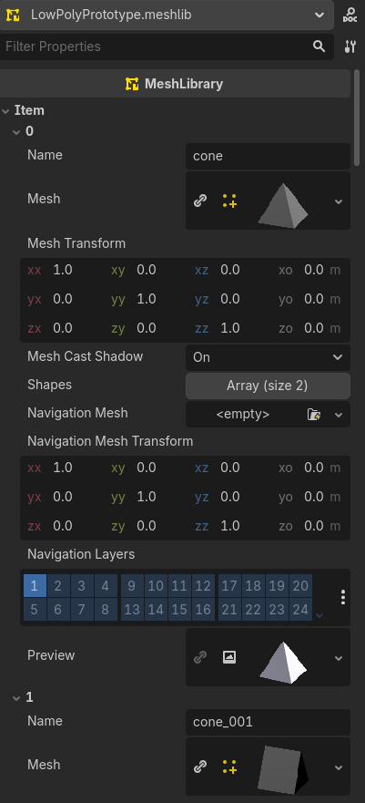
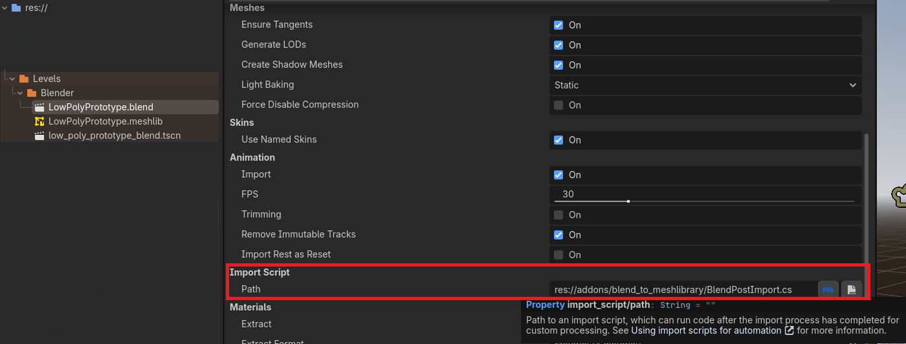
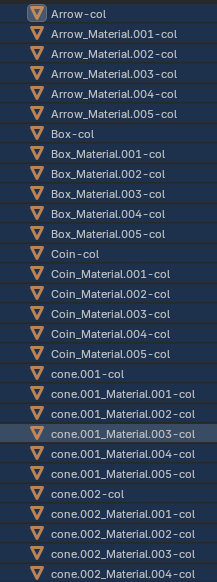
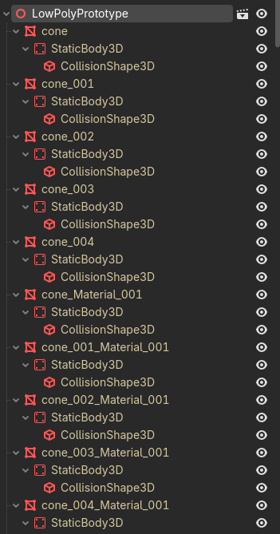

# .Blend to MeshLibrary Godot Addon

A Godot Editor Addon for .NET/C# projects that automates the creation of `MeshLibrary` resources from `.blend`, `.glb`, or `.gltf` files, complete with high-quality, automatic preview generation.

This tool is designed to streamline the workflow for creating levels with `GridMap`, allowing you to design your tileset directly in Blender and have it seamlessly imported into Godot as a ready-to-use `MeshLibrary`.

## Features

- **Automatic MeshLibrary Creation**: Creates a `.meshlib` resource when you save a `.blend` file in your project.
- **High-Quality Preview Generation**: Generates clean, well-lit, and perfectly framed preview images for every item.
- **Physics and Navigation Support**: Automatically detects and configures collision shapes and navigation meshes from your Blender file.
- **Standard Blender Workflow**: Uses Godot's built-in import features like `-col` suffixes for a seamless experience.
- **Non-Destructive Re-importing**: Option to preserve manually set previews when your models change.
- **Robust and Stable**: Intelligently structures the `MeshLibrary` to prevent common `GridMap` errors.

## Prerequisites

For the addon to import `.blend` files, **you must have Blender installed** and tell Godot where to find it.

1. Open Godot's editor settings: `Editor` -> `Editor Settings`.
2. Go to `Filesystem` -> `Import` -> `Blender`.
3. Set the `Blender Path` to point to your Blender executable.

## Basic Workflow

1. **Installation**: Install the addon from the Asset Library or by copying the `addons/` folder into your project.
2. **Enable the Addon**: In `Project Settings` -> `Plugins`, enable the ".Blend to MeshLibrary" plugin.
3. **Design in Blender**: Create your tileset in a `.blend` file following the guidelines in the **Blender Workflow** section below.
4. **Configure the Import Script**: Save the `.blend` file anywhere in your project directory. By default, Godot imports this as a standard 3D scene. To generate a `MeshLibrary`, you must attach the post-import script:
   - Select your `.blend` (or `.glb`/`.gltf`) file in the Godot `FileSystem` dock.
   - Navigate to the `Import` dock.
   - Locate the `Import Script` (or `Custom Script`) property.
   - Assign the `BlendPostImport.cs` script to this field.
   - Click the **Reimport** button.

   

5. **Automatic Previews**: After reimporting, a `your_file_name.meshlib` resource will be generated alongside your source file. The plugin will then automatically generate clean, framed previews for all items in the library.
6. **Use in GridMap**: Select your `GridMap` node and assign the newly created `.meshlib` file to its `Mesh Library` property.

## Blender Workflow

To ensure your `.blend` file is processed correctly, follow these guidelines. The addon processes each top-level, visible object in your scene as a potential `MeshLibrary` item.

### Basic Structure

- Each tile for your `GridMap` should be a separate, top-level object in your Blender scene.
- The name of the object in Blender (e.g., `wall_corner`, `floor_tile`) will become the name of the item in the `MeshLibrary`.
- Make sure that transforms (location, rotation, scale) are applied if you don't want them to be part of the item's offset in the `MeshLibrary`.

### Creating Collision Shapes

The addon leverages Godot's standard import suffixes. To add a collision shape to a mesh, create a separate mesh in Blender and add the `-col` suffix to its name.

- **Example**: You have a visual mesh named `rock`. Create a second, lower-poly mesh that covers its shape and name it `rock-col`.
- When imported, the `rock-col` mesh will be removed from view and a `StaticBody3D` with a `CollisionShape3D` will be generated for the `rock` item.

- The original `rock-col` mesh will not be included as a visible item in the `MeshLibrary`.
- You can use this for multiple items. A `wall-col` mesh will create collision for the `wall` mesh, and so on.

For more complex scenarios, you can manually add `StaticBody3D` and `CollisionShape3D` nodes in the Godot Import Scene dock, and the addon will also include them.

### Creating Navigation Meshes

Similar to collision, you can add a navigation mesh for AI pathfinding.

- Create a mesh that defines the walkable area for an item.
- In the Godot Import Scene dock, select this mesh, go to the "Mesh" menu, and choose "Create Navigation Mesh".
- The addon will detect the generated `NavigationRegion3D` and assign the navigation mesh to the corresponding `MeshLibrary` item.

## Project Settings

This addon adds one project setting, which you can find in `Project` -> `Project Settings` -> `General` -> `Blend To Meshlibrary`.

- **`Overwrite Previews On Reimport`** (`blend_to_meshlibrary/overwrite_previews_on_reimport`)
  - **Type**: `bool` (true/false)
  - **Default**: `true`
  - **Description**:
    - If `true`, the addon will regenerate all item previews every time the source `.blend` file is re-imported. This is the default and recommended behavior.
    - If `false`, the addon will attempt to preserve any existing previews. This is useful if you have manually assigned a custom preview to an item and you don't want to lose it on re-import.

## Compatibility

- **Godot Version**: This is a C# addon, so it requires a version of Godot with **.NET support enabled**.
- **Language Compatibility**:
  - The addon itself is written in **C#**.
  - However, the `.meshlib` file it generates is a standard Godot resource. This means it can be used from **any language** that Godot supports, including **GDScript**, **C#**, **C++** (via GDExtension), and **Rust** (via godot-rust). You do not need to be using C# in your game's logic to use the generated `MeshLibrary`.

## License

This addon is distributed under the MIT License. See the `LICENSE` file for more details.
